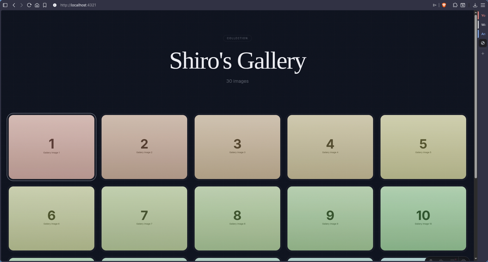
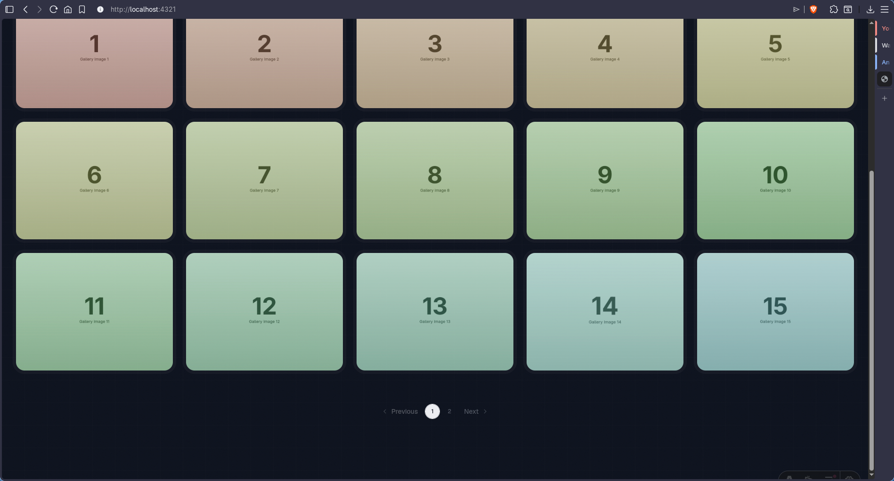
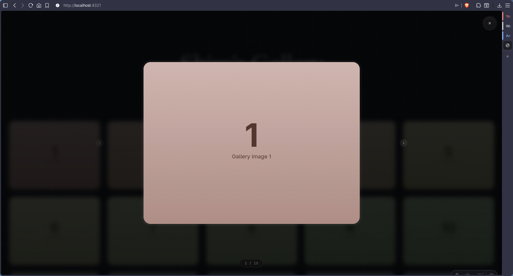

<p align="center">
  
  
  
  
</p>

<h1 align="center">Shiro's Gallery</h1>

<p align="center">
  A dark, responsive image gallery with a full-screen carousel, Bento grid layout,
  <br>
  and automatic HEIC conversion — powered by Astro and ready to deploy.
</p>

<p align="center">
  <a href="#-features">Features</a>   ·  
  <a href="#-quick-start">Quick Start</a>   ·  
  <a href="#-adding-images">Adding Images</a>   ·  
  <a href="#-customization">Customization</a>   ·  
  <a href="#-deploy-to-github-pages">Deploy</a>   ·  
  <a href="#-tech-stack">Tech Stack</a>
</p>

<br>

<div align="center">
  
  
  
</div>

<br>

---

## ✨ Features

<table>
  <tr>
    <td>📐</td>
    <td><b>5-column responsive grid</b> with pagination</td>
  </tr>
  <tr>
    <td>🖼️</td>
    <td><b>Full-screen carousel</b> — click any image to browse</td>
  </tr>
  <tr>
    <td>📱</td>
    <td><b>HEIC → WebP</b> auto-conversion on build (iPhone photos)</td>
  </tr>
  <tr>
    <td>🎨</td>
    <td><b>Dark blue pastel</b> palette with subtle noise &amp; grid overlays</td>
  </tr>
  <tr>
    <td>🪟</td>
    <td><b>Double-Bezel</b> card architecture</td>
  </tr>
  <tr>
    <td>🚀</td>
    <td><b>One-click deploy</b> to GitHub Pages</td>
  </tr>
</table>

<br>

---

## 🚀 Quick Start

```sh
git clone https://github.com/shiro-devv/shiros-gallery
cd shiros-gallery
npm install
npm run dev
```

> Open [localhost:4321](http://localhost:4321) in your browser.

<br>

---

## 🖼️ Adding Images

Drop your images into **`src/assets/`**. Supported formats:

<p>
  <code>jpg</code> ·
  <code>jpeg</code> ·
  <code>png</code> ·
  <code>webp</code> ·
  <code>avif</code> ·
  <code>heic</code> ·
  <code>heif</code>
</p>

> **📱 HEIC/HEIF files** (iPhone photos) auto-convert to WebP when you run `npm run build`.  
> Preview your changes live with `npm run dev`.

<br>

---

## 🎨 Customization

<table>
  <tr>
    <th>What</th>
    <th>Where</th>
  </tr>
  <tr>
    <td>Title &amp; heading</td>
    <td><code>src/components/GalleryApp.tsx</code> — search for <code>Shiro's Gallery</code></td>
  </tr>
  <tr>
    <td>Images per page</td>
    <td><code>src/components/GalleryApp.tsx</code> — change <code>PER_PAGE</code></td>
  </tr>
  <tr>
    <td>Colors</td>
    <td><code>src/styles/global.css</code> — edit <code>:root</code> variables</td>
  </tr>
  <tr>
    <td>Grid columns</td>
    <td><code>src/components/GalleryApp.tsx</code> — change <code>md:grid-cols-5</code></td>
  </tr>
  <tr>
    <td>Noise &amp; grid overlays</td>
    <td><code>src/styles/global.css</code> — tweak <code>::before</code> / <code>::after</code> opacities</td>
  </tr>
</table>

<br>

---

## 📦 Deploy to GitHub Pages

<details>
<summary><b>I already have a <code>&lt;username&gt;.github.io</code> page</b></summary>
<br>

Host the gallery as a separate project at a subpath.

| Step | Action |
|------|--------|
| 1 | Create a new repo (e.g. `gallery`, `shiros-gallery`) |
| 2 | Update `base` in [`astro.config.mjs`](astro.config.mjs): `base: '/your-repo-name/'` |
| 3 | Push to `main` |
| 4 | Go to **Settings → Pages → Source** → select **GitHub Actions** |
| 5 | ✅ Live at `https://your-username.github.io/your-repo-name/` |

</details>

<details>
<summary><b>I'm starting fresh — no GitHub Page yet</b></summary>
<br>

Host the gallery at the root of your personal site.

| Step | Action |
|------|--------|
| 1 | Create a repo named `<your-username>.github.io` |
| 2 | Set `base: '/'` in [`astro.config.mjs`](astro.config.mjs) |
| 3 | Push to `main` |
| 4 | Go to **Settings → Pages → Source** → select **GitHub Actions** |
| 5 | ✅ Live at `https://your-username.github.io/` |

</details>

<br>

---

## 🧰 Tech Stack

<p align="center">
  <a href="https://astro.build"></a>
  <a href="https://react.dev"></a>
  <a href="https://tailwindcss.com"></a>
  <a href="https://ui.shadcn.com"></a>
  <a href="https://pages.github.com"></a>
</p>
